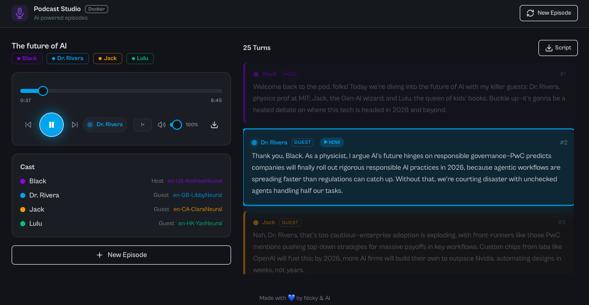

# 🎙️ Podcast Studio

AI-powered podcast episode generator. Enter a topic, configure your host and guests, and get a fully voiced MP3 episode with a grounded script — in under 2 minutes.



## How It Works

1. **News search** — Perplexity Sonar API fetches the latest news on your topic
2. **Script generation** — Perplexity `sonar-pro` writes a multi-turn conversation script grounded in real headlines
3. **Voice synthesis** — Microsoft Edge TTS (free, no API key) synthesizes each turn with distinct voices
4. **Audio merge** — ffmpeg stitches all turns into one final MP3

## Requirements

| Dependency | Purpose | Cost |
|---|---|---|
| [Perplexity API key](https://www.perplexity.ai/settings/api) | News search + script generation | Pay-per-use |
| Microsoft Edge TTS | Voice synthesis | **Free** |
| ffmpeg | Audio merging | **Free** |

---

## Run with Docker (Recommended)

### 1. Get your Perplexity API key
Sign up at https://www.perplexity.ai/settings/api and copy your key.

### 2. Create a `.env` file
```bash
cp .env.example .env
# Edit .env and paste your PPLX_API_KEY
```

### 3. Build and run
```bash
# Note: If you are on macOS and encounter 'docker: command not found' 
# or 'docker-credential-desktop: executable file not found in $PATH',
# you need to explicitly include /usr/local/bin in your PATH first:
export PATH="/usr/local/bin:$PATH"

docker compose up --build
```

> **Note on image pull issues (EOF errors)**:  
> If you get `failed to do request: Head "...": EOF` during the build, it's due to network instability connecting to Docker Hub.  
> **Solution 1:** Add registry mirrors in Docker Desktop -> Settings -> Docker Engine:
> ```json
> {
>   "registry-mirrors": [
>     "https://docker.m.daocloud.io",
>     "https://docker.nju.edu.cn"
>   ]
> }
> ```
> **Solution 2:** Disable BuildKit before running docker compose:  
> `export DOCKER_BUILDKIT=0`

Open http://localhost:8000 in your browser.

### 4. Background execution & Stopping the container
```bash
export PATH="/usr/local/bin:$PATH" # For macOS users

# Run the container in the background (detached mode)
docker compose up -d --build

# View the logs of the background container
docker compose logs -f

# To cleanly STOP the container when you are done:
docker compose down
```

---

## Run with Docker (pre-built image)

If you publish the image to Docker Hub:

```bash
docker run -d \
  --name podcast-studio \
  -p 8000:8000 \
  -e PPLX_API_KEY=your_key_here \
  your-dockerhub-username/podcast-studio:latest
```

---

## Build the image manually

```bash
# Build
docker build -t podcast-studio:latest .

# Run
docker run -d \
  -p 8000:8000 \
  -e PPLX_API_KEY=your_key_here \
  podcast-studio:latest
```

---

## Run without Docker (development)

### Prerequisites
- Node.js 20+
- Python 3.11+
- ffmpeg installed (`brew install ffmpeg` / `apt install ffmpeg`)

### Setup
```bash
# Install Node dependencies
npm install

# Install Python dependencies
pip install -r requirements.txt

# Set your API key
export PPLX_API_KEY=pplx-your-key-here

# Terminal 1: Start Python backend
python api_server.py

# Terminal 2: Start React frontend
npm run dev
```

Open http://localhost:5000

---

## Features

- **1 Host + 1–3 Guests** — each with a unique voice
- **Voice descriptions** — natural language like "serious female scientist" auto-resolved to the best Edge TTS voice
- **Voice preview** — hear a 5-second sample before generating
- **5 Tone presets** — Casual, Debate, Academic, Storytelling, Satirical
- **2–20 conversation turns**
- **10 languages** — English, Chinese, Spanish, French, German, Japanese, Korean, Portuguese, Arabic, Hindi
- **News-grounded scripts** — real headlines woven into the conversation
- **Downloadable** — MP3 audio + plain-text script

## Edge TTS Voices

The app maps persona descriptions to ~40 curated Edge TTS voices across 10 languages. Examples:

| Description | Resolved Voice |
|---|---|
| `serious female scientist` | `en-GB-SoniaNeural` |
| `warm authoritative male host` | `en-US-ChristopherNeural` |
| `casual energetic journalist` | `en-US-GuyNeural` |
| `calm british professor` | `en-GB-RyanNeural` |
| `friendly chinese female host` | `zh-CN-XiaoxiaoNeural` |

---

## Quick Start (Local Development)

### Start the service

```bash
# Activate virtual environment (if using one)
source .venv/bin/activate  # or: source .venv/bin/activate.fish

# Start the backend server
python api_server.py
```

The server will start on http://localhost:8000

### Stop the service

**Option 1: If running in foreground**
Press `Ctrl+C` in the terminal where the server is running.

**Option 2: If running in background**
```bash
# Find the process
ps aux | grep api_server

# Stop by PID
kill <PID>

# Or stop all related processes
pkill -f "api_server.py"
```

---

## Architecture

```
┌─────────────────────────────────────────┐
│           Docker Container              │
│                                         │
│  ┌─────────────────────────────────┐   │
│  │   FastAPI (port 8000)           │   │
│  │   ├── /           → React SPA   │   │
│  │   ├── /api/generate             │   │
│  │   │   ├── Perplexity Sonar      │   │
│  │   │   │   (news search)         │   │
│  │   │   ├── Perplexity sonar-pro  │   │
│  │   │   │   (script generation)   │   │
│  │   │   ├── Edge TTS              │   │
│  │   │   │   (voice synthesis)     │   │
│  │   │   └── ffmpeg (audio merge)  │   │
│  │   └── /api/voices/preview       │   │
│  └─────────────────────────────────┘   │
└─────────────────────────────────────────┘
```

---

## License

This project is licensed under the MIT License - see the [LICENSE](LICENSE) file for details.

### Third-Party Dependencies

| Dependency | License | Purpose |
|---|---|---|
| [edge-tts](https://github.com/rany2/edge-tts) | LGPLv3 | Voice synthesis |
| [fastapi](https://github.com/fastapi/fastapi) | MIT | Web framework |
| [uvicorn](https://github.com/encode/uvicorn) | BSD-3-Clause | ASGI server |
| [httpx](https://github.com/encode/httpx) | MIT/BSD | HTTP client |
| [pydantic](https://github.com/pydantic/pydantic) | MIT | Data validation |
| [tinytag](https://github.com/tinytag/tinytag) | MIT | Audio metadata |
| [python-dotenv](https://github.com/theskumar/python-dotenv) | BSD | Environment variables |

### Important Notes

- **edge-tts (LGPLv3)**: Used as an external library without modification. Under LGPLv3, this project can maintain its MIT License since we only call/link to edge-tts as a dependency without modifying its source code.
- **Microsoft Edge TTS**: This is an unofficial interface to Microsoft's speech service. Use in production or commercial contexts may be subject to Microsoft's Terms of Service. For commercial deployments, consider using officially licensed TTS services like Azure Speech Services or Google Cloud Text-to-Speech.

---

## Security Note

⚠️ **Never commit your `.env` file or API keys to version control.**

The `.gitignore` file is configured to exclude:
- `.env` files (contains your `PPLX_API_KEY`)
- `node_modules/` (dependencies)
- `dist/` (build output)
- Generated podcast files (`podcasts/*.mp3`)

When deploying, always set your API key via environment variables or a secure secrets management system.
